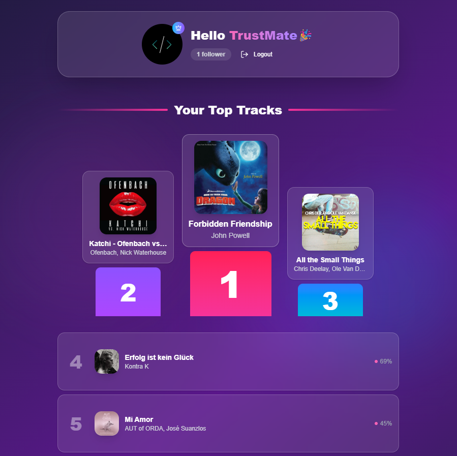

# 🎵 TopTune – Spotify Top Tracks

TopTune is a beautifully designed web app to showcase your top 10 tracks from Spotify. Whether you're a casual listener or a music junkie, TopTune gives you a visual snapshot of your most-played songs with style.



## 🚀 Features

- 🎶 Displays your Top 10 Spotify tracks
- ✨ Clean, modern, and responsive UI
- 💚 Integrates seamlessly with the Spotify Web API via PKCE Auth Flow
- ⚡ Fast and smooth user experience using React and Tailwind CSS

## 📦 Installation

1. **Clone the repository**

   ```bash
   git clone https://github.com/your-username/toptune.git
   cd toptune
   ```

2. **Install dependencies using Yarn**

   ```bash
   yarn install
   ```

3. **Run the development server**

   ```bash
   yarn dev
   ```

4. Open your browser and go to `http://127.0.0.1:3000` to see it live.

## 🛠️ Configuration

You’ll need to set up your own Spotify API credentials.

1. Go to the [Spotify Developer Dashboard](https://developer.spotify.com/dashboard/)
2. Create an app and get your `Client ID`
3. Set the necessary environment variables in a `.env.local` file:

   ```env
   VITE_SPOTIFY_CLIENT_ID=your_client_id
   ```
